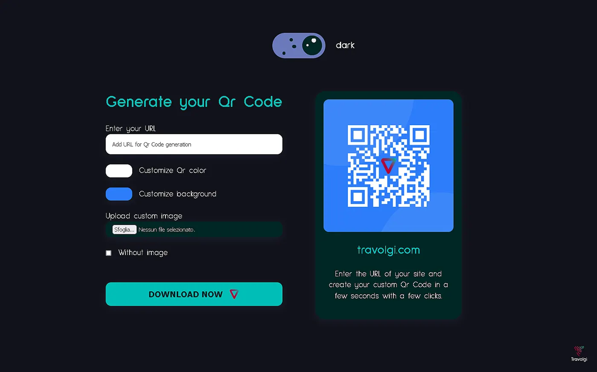
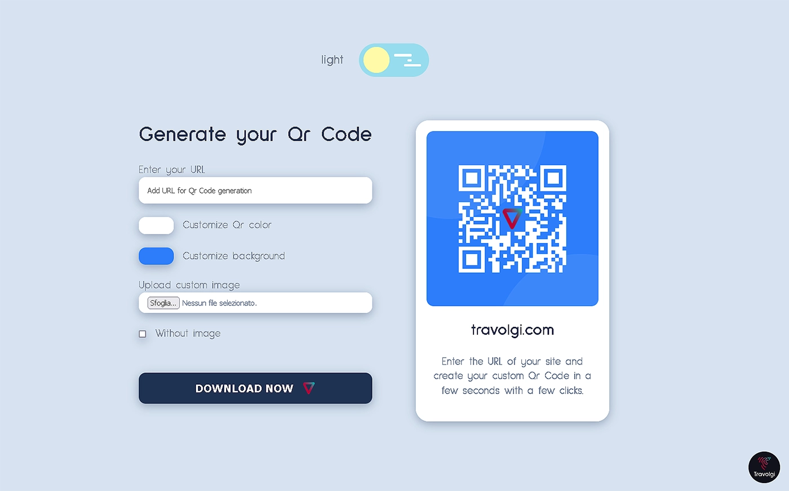

# Qr Code Generator with color theme switcher

This app generates Qr Code based on the entered URL. It is also possible to customize and download the generated Qr Code

## Table of contents

- [About App](#about-app)
- [Process](#process)
  - [Built with](#built-with)
  - [Continued development](#continued-development)
  - [Useful resources](#useful-resources)
- [Getting Started](#getting-started)
  - [System Requirements](#system-requirements)
  - [Installation](#installation)
  - [Bugs](#bugs)
  - [Contributing](#contributing)
- [License](#license)

## About App

This app generates Qr Code based on the url entered

Features:
- Light / dark mode theme switcher
- Dynamically generating the Qr Code as you type the URL
- Dynamically update the color and background of the Qr Code based on the customization input entered by the user
- Dynamically update the customized image of the Qr Code
- Removes the custom image of the Qr Code
- You can download the `.png` of the generated Qr Code

## Process

### Built with

- Semantic HTML5 markup
- CSS custom properties
- Grid & Flexbox
- [React](https://reactjs.org/) - Js library
- [QRCode.react](https://www.npmjs.com/package/qrcode.react) - Qr Code package
- [React Color](https://casesandberg.github.io/react-color/) - Color Pickers package

### Continued development

Future features:
- Serverless database connection
- Authentication with login
- Save the Qr Code generated

### Useful resources

- [QRCode.react](https://www.npmjs.com/package/qrcode.react)
- [React Color](https://casesandberg.github.io/react-color/)

